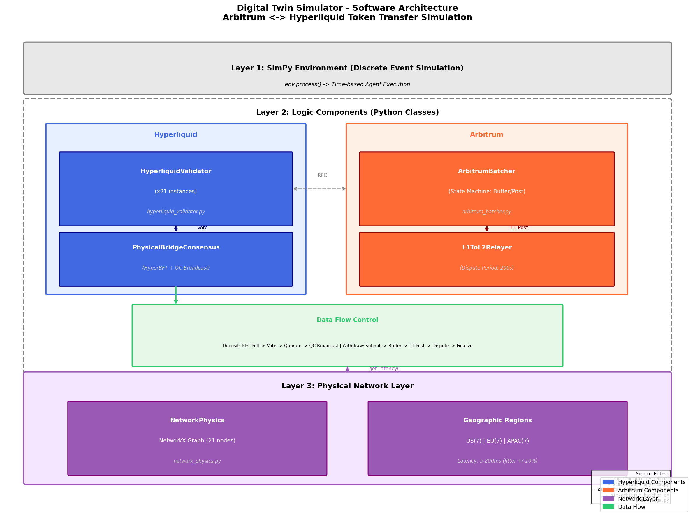
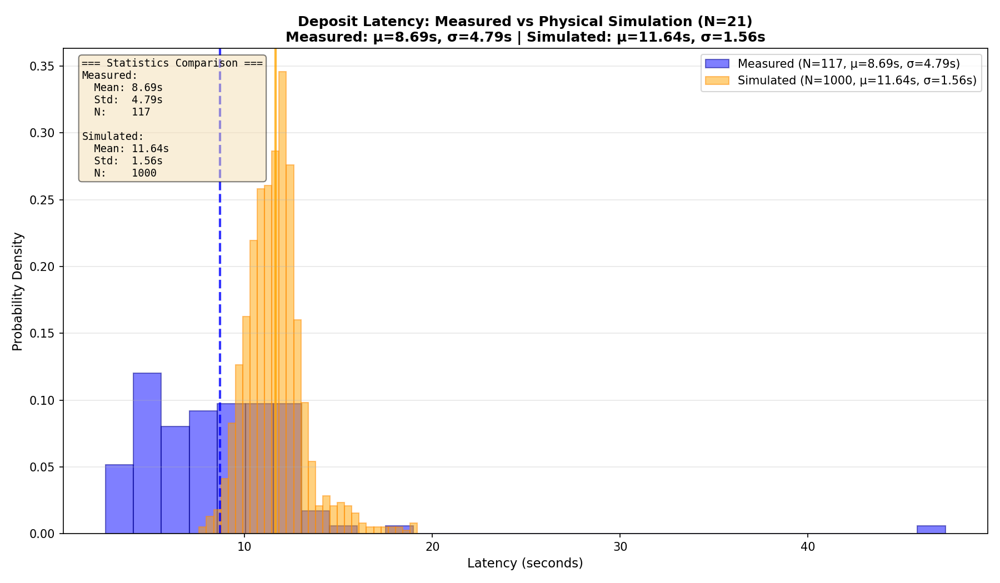
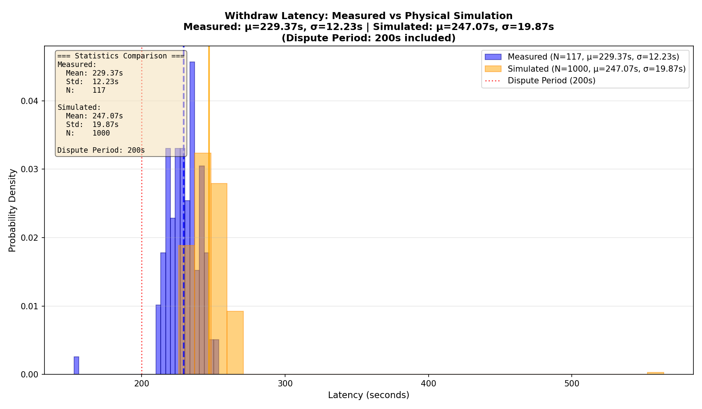

# Arbitrum-Hyperliquid Cross-chain Bridge Simulator (Digital Twin)

[](https://www.python.org/downloads/)
[](https://simpy.readthedocs.io/)

A physics-based discrete event simulator for analyzing cross-chain token transfer latency between **Arbitrum (L2)** and **Hyperliquid (L1)**.

物理ベースの離散イベントシミュレータ。**Arbitrum (L2)** と **Hyperliquid (L1)** 間のクロスチェーントークン転送レイテンシを分析します。

---

## Overview / 概要

This simulator implements a "Digital Twin" approach, modeling the actual physical behavior of cross-chain bridge operations rather than using probabilistic approximations.

このシミュレータは「デジタルツイン」アプローチを採用し、確率的な近似ではなく、クロスチェーンブリッジ操作の実際の物理的挙動をモデル化しています。



---

## Key Features / 主な特徴

### 1. Network Physics / ネットワーク物理学
- **NetworkX-based topology**: 21 validator nodes in a full-mesh configuration
- **Geographic regions**: US (7), EU (7), APAC (7) with realistic latency
  - Intra-region: 5-20 ms
  - Inter-region: 80-200 ms
- **Dynamic jitter**: +/- 10% variation on base latency

### 2. Hyperliquid Consensus / Hyperliquidコンセンサス
- **N=21 validators**: Matches mainnet configuration
- **HyperBFT consensus**: Leader-based BFT with Quorum Certificate (QC) broadcast
- **Quorum size**: 15 (2/3 + 1)
- **Round-trip latency**: Vote collection -> QC creation -> QC broadcast

### 3. Arbitrum Batcher / Arbitrumバッチャー
- **State machine design**: Buffer/Post logic using `simpy.Container`
- **Trigger conditions** (OR logic):
  - Size threshold: 120 KB
  - Time threshold: 300 seconds (5 min)
- **L1 confirmation**: 2 blocks (24 seconds)

### 4. Bridge Mechanics / ブリッジメカニズム
- **Deposit (L1 -> L2)**: RPC polling -> Vote -> Quorum -> QC Broadcast -> Finalize
- **Withdraw (L2 -> L1)**: Submit -> Buffer -> L1 Post -> Dispute Period (200s) -> Finalize

---

## Results / 結果

### Deposit Latency / デポジットレイテンシ


### Withdraw Latency / 出金レイテンシ


---

## Installation / インストール

```bash
# Clone repository
git clone https://github.com/YOUR_USERNAME/token_transfer_measurement.git
cd token_transfer_measurement

# Install dependencies
pip install simpy networkx matplotlib pandas
```

---

## Usage / 使用方法

### Run Physics Simulation / 物理シミュレーション実行

```bash
# Run 1000 Deposit + 1000 Withdraw transactions
python run_sim_auto.py --physics --tx_count 1000

# With verbose logging (for debugging)
python run_sim_auto.py --physics --tx_count 100 --verbose
```

### Generate Comparison Histograms / 比較ヒストグラム生成

```bash
python generate_comparison_histograms.py
```

### Output Files / 出力ファイル

| File | Description |
|------|-------------|
| `result/sim_trace_deposit_physics.csv` | Deposit transaction trace |
| `result/sim_trace_withdraw_physics.csv` | Withdraw transaction trace |
| `result/histogram_deposit_physics.png` | Deposit latency distribution |
| `result/histogram_withdraw_physics.png` | Withdraw latency distribution |

---

## Parameters / パラメータ

See [`simulation_parameters_clean.csv`](simulation_parameters_clean.csv) for the complete list of simulation parameters.

完全なパラメータ一覧は [`simulation_parameters_clean.csv`](simulation_parameters_clean.csv) を参照してください。

| Category | Parameter | Value | Description |
|----------|-----------|-------|-------------|
| Network | Topology | Full Mesh (21 nodes) | All validators connected |
| Hyperliquid | Validator Count | 21 | Mainnet configuration |
| Hyperliquid | Quorum Size | 15 (2/3 + 1) | Byzantine fault tolerance |
| Arbitrum Batcher | Size Threshold | 120 KB | Trigger batch post |
| Bridge | Dispute Period | 200.0 s | Experimental setting |

---

## Project Structure / プロジェクト構成

```
.
├── run_sim_auto.py                 # Main simulation script
├── generate_comparison_histograms.py  # Histogram generator
├── simulation_parameters_clean.csv # Parameter reference
├── sim/                            # Core simulation modules
│   ├── network_physics.py          # Geographic latency model
│   ├── hyperliquid_validator.py    # Validator agents & BFT consensus
│   ├── arbitrum_batcher.py         # Batcher state machine & relayer
│   ├── bridge.py                   # Bridge consensus (legacy)
│   ├── sequencer.py                # Arbitrum sequencer
│   ├── chain.py                    # Chain abstraction
│   └── oracle.py                   # Safety oracle
├── docs/                           # Documentation images
│   ├── architecture_diagram.png
│   ├── comparison_deposit_physics.png
│   └── comparison_withdraw_physics.png
└── result/                         # Generated output (git-ignored)
```

---

## License / ライセンス

This project is for research purposes.

このプロジェクトは研究目的です。

---

## Author / 著者

Created for Professor Fujihara's research on cross-chain bridge latency analysis.

